# Image Classification Report


**<ins>Main goal:**   
To develop a model able to predict over 196 different classes of the Stanford Cars dataset.

**<ins>Method:**  
Transfer-learning & Fine-Tuning.

**<ins>Tools:**  
CNN ResNet50, pre-trained with "Imagenet". 
Meaning a model that was trained with more than a million images, able to classify 1000 object categories.

16,185 vehicle images divided in half for both training and testing [^1].

**<ins>Pros:**  
Rich feature representations for a wide range of images.

**<ins>Cons:**  
Daily objects that are far from being ideal to predict exclusively vehicles [^1].

---

# <ins>Approach:<ins>

Unlike feature extraction, when we perform fine-tuning we are actually building a new fully connected head and place it on top of the original architecture.  
The new FC layer head is randomly initialized (just like any other layer in a new network) and trained along the frozen layers of the original network.   

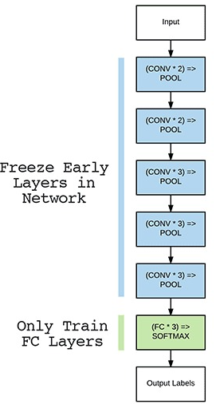

Below you may find the learning curves of the first attempts where 3 stages are appreciated.  
Each with several param config esperiments.  
<ins>Validation acc:<ins>
* 0.20 - 0.25
* 0.30 - 0.35
* 0.35 - 0.4

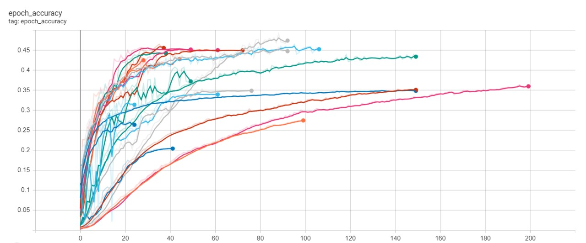

---

<ins>**First attempt:**

Training one dense layer, with as much neurons as output classes, with softmax activation.  

Adam Optimization
~~~
Poor validation accuracy: around 0.2
~~~

<ins>**Second attempt:**

So, why not trying to give the model more complexity, following some rules of thumb?  

```python
x = layers.GlobalAveragePooling2D()(x)
x = layers.Dropout(dropout_rate)(x)
x = layers.BatchNormalization()(x)

x = layers.Dense(1024, activation='relu')(x) 
x = layers.Dropout(dropout_rate)(x)
x = layers.BatchNormalization()(x)

x = layers.Dense(516, activation='relu')(x) 
x = layers.Dropout(dropout_rate)(x)
x = layers.BatchNormalization()(x)

outputs = layers.Dense(classes, activation='softmax')(x) 
```
**This last meassures lead to the decition of decreasing dropout rate.**
~~~
Anyways, model was stuck around 0.35 acc.
~~~
<ins>**Third attempt:**

More focus on data augmentation:
1. Added Random Contrast.
2. Reduced Random Rotation (there's no point in an almost flipped car).  

Increased Batch Size to 64.  
Increased Epsilon (main reason for further improvement).  
Adding l2 regularization to last layer.

~~~
Reached a cap around 0.45 but in most cases with high loss and on top of that, overfitting.
~~~
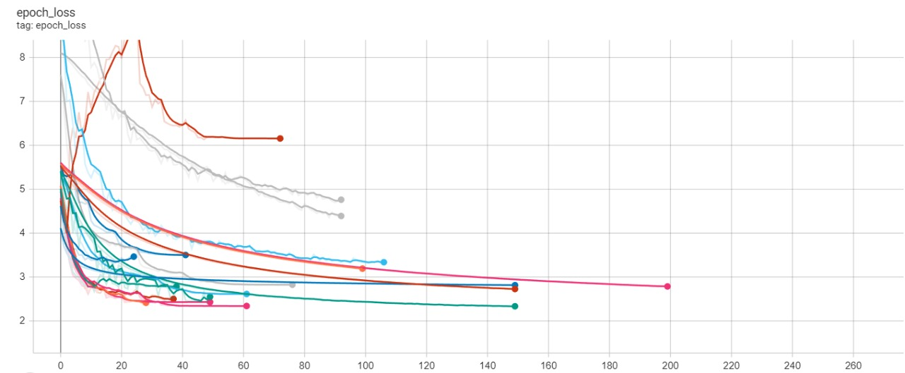

---
## Changing approach
At this point, it was clear that model would always underfit with the architecture as it was. So it became necessary to unfreeze more layers and give the network more degrees of freedom.


**What needed to be taken into account** before proceeding is the fact that the ResNet50 CONV layers have already learned rich, discriminative filters while our FC layers are brand new and totally random.  
If we allow the gradient to backpropagate from these random values all the way through the network, there is a risk on destroying the already learnt features.  
To bypass this problem, we should first train, with ResNet50 completely frozen, letting our FCL to "Warm up".

In other words, training data will be forward propagated through the network but the backpropagation is stopped after the FC layers.

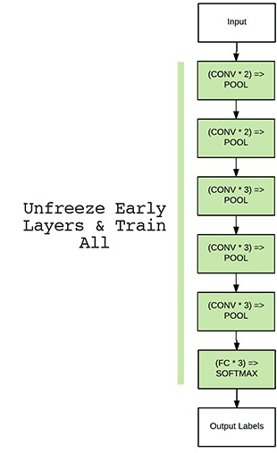

---
## Warm Up

In hindsight, all previous experimentation wasn't in vane.  
From there it was selected the curve with steepest slope, lower loss and least overfitting to run a short warm up of 8 epochs, in order to prepare the network to be unfreezed and retrained, with a clean starting point.

Once selected, the script would load those weights, recompile and retrain.  
**But from which point?**

```python
if not os.path.exists('models/init_fcl_weights.h5'):
    callbacks = parse_callbacks(warmup_config)
    cnn_model.fit(
        train_ds, validation_data=val_ds, callbacks=callbacks, **warmup_config["fit"]
    )
    print('=================================================')
    print('#1 Saving FCL Weights...')
    cnn_model.save_weights('models/init_fcl_weights.h5')
else:
    print('=================================================')
    print('#1 Loading pre-trained FCL Weights...')
    cnn_model.load_weights('models/init_fcl_weights.h5')

print('=================================================')
print('#2 FCLayers already warmed up')
print('#3 Unfreezing CONV Layers')
base_model = cnn_model.get_layer('resnet50')
base_model.trainable = True
for layer in base_model.layers[:19]: 
    layer.trainable = False       

print('=================================================')
print(cnn_model.summary())
for i, layer in enumerate(base_model.layers):
    print(i, layer.name, '-', layer.trainable)

print('#4 Recompiling the model')
optimizer = parse_optimizer(finetun_config)
cnn_model.compile(
    optimizer=optimizer,
    **finetun_config["compile"],
)

print('#5 Retraining both CONV and FC Layers')
print('=================================================')
callbacks = parse_callbacks(finetun_config)
cnn_model.fit(
    train_ds, validation_data=val_ds, callbacks=callbacks, **finetun_config["fit"]
)

print('#6 Saving model...')
print('=================================================')
cnn_model.save('models/TLRN50_Fmodel.h5')
print('#7 Saving weights...')
print('=================================================')
cnn_model.save_weights('models/TLRN50_Fmodel_weights10.h5')
```
---
## Model surgery and fine tuning

As training only the head was far from being enough, and as per the characteristics of this particular problem. i.e:
1. Small Dataset.
2. Different Dataset from original (img types).  
   
**Decided then to conserve only the first stage of ResNet50 so as to make the best of the already trained basic features (iow until layer 18).**


<br></br>

<ins>Things taken into account before proceeding:

- [ ] Learning rate needs to be way lower, than warm up, for network stability.
- [ ] Despite unfreezing layers, model should maintain (training=False). Otherwise, we would be updating values of BatchNormalization layers inside ResNet50, which should remain Non-trainable at all times.

---
### Experiments

Several attempts to find any kind of sweet spot.
For clarity matters, most of experiments have been left out.
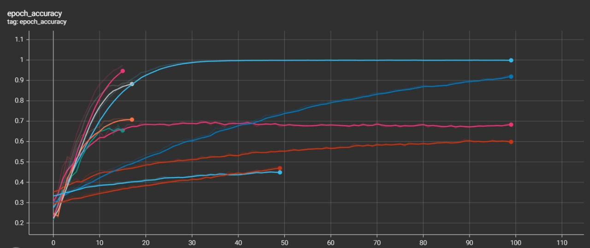
Some of the following types of "loss outliers" were caused by any type of kernel regularizer (l1, l2, l1_l2).
Reason why, final model doesn't have any of them at all.
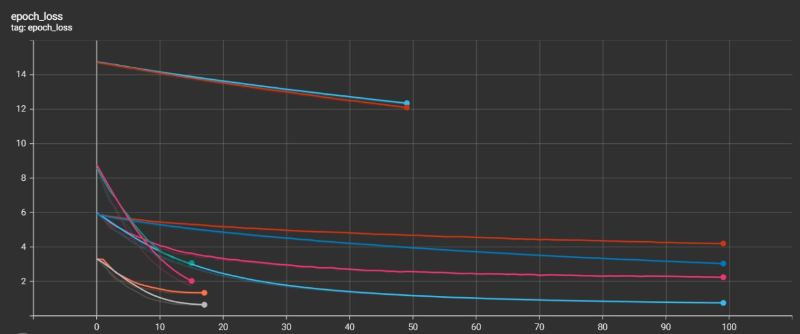

**Just for curiosity sake, a training was run from scratch without warmup with the same architecture used until that point.**
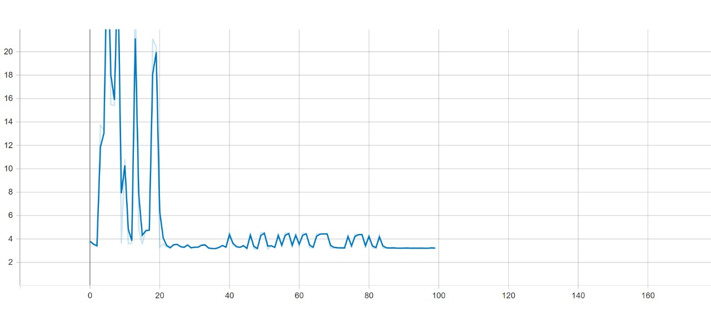
As a result, an example of loss shooting through the roof without warm up in the left side, and the right side of course with warm up.
The guess is that it would probably be accomplishable without it but with the right parameters and architecture. i.e:
* Even lower learning rate.
* Training the whole model and not starting from anypoint in the middle.

---
## More Hardcore Data Augmentation

On top of previous tuning, a decent improvement was made when the background in the images was removed using **Detectron2** to box the main and biggest vehicle in each image.

```python
setup_logger()
cfg = get_cfg()
cfg.merge_from_file(model_zoo.get_config_file("COCO-Detection/faster_rcnn_R_101_FPN_3x.yaml"))
cfg.MODEL.ROI_HEADS.SCORE_THRESH_TEST = 0.5  # set threshold for this model
cfg.MODEL.WEIGHTS = model_zoo.get_checkpoint_url("COCO-Detection/faster_rcnn_R_101_FPN_3x.yaml")

DET_MODEL = DefaultPredictor(cfg)
outputs = DET_MODEL(img)

car_classes = outputs["instances"].pred_classes==2
truck_classes = outputs["instances"].pred_classes==7
obj_classes_boxes = outputs['instances'][car_classes | truck_classes].pred_boxes.tensor.cpu()

if not obj_classes_boxes.any():
    return np.append([0,0], np.shape(img)[0:-1])
else:
    max_box_index = int(box_area(obj_classes_boxes).argmax().numpy())
    box_coordinates = tuple(outputs['instances'].pred_boxes[max_box_index].tensor.cpu().tolist()[0])
    return box_coordinates
```

```python
for dir_path, img_name in walkdir(data_folder):
    img_path = os.path.normpath(dir_path+'/'+img_name)
    new_img_path = dir_path.replace('car_ims_v1', 'car_ims_v2')
    if not os.path.exists(new_img_path):
        os.mkdir(new_img_path)
    else:
        pass
    new_img_path = os.path.normpath(new_img_path+'/'+img_name)
    img = cv2.imread(img_path)
    l, t, r, b = get_vehicle_coordinates(img)
    cropped_img = img[int(t):int(b), int(l):int(r)]
    print(new_img_path)
    cv2.imwrite(new_img_path, cropped_img)
```
---
## Game changers

Turning from Adam optimizer to SGD + momentum was a success, since most of the improvement was made by a manual supervised step decay of the Learning Rate (with Ctrl + c training) and tuning the momentum with close attention.

```python
def scheduler(epoch, lr):
    if epoch < 7: 
        return 0.001
    if epoch < 8:
        return 0.0005
    if epoch < 16:
        return 0.00005
    else:
        return 0.00001
```
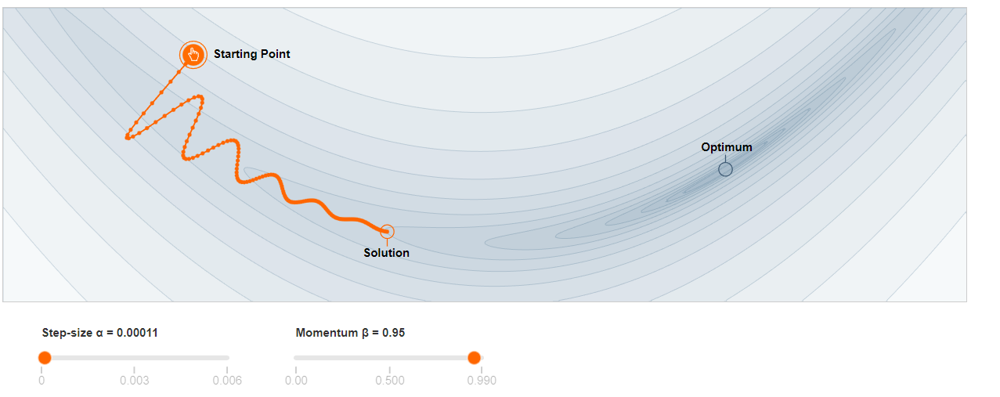
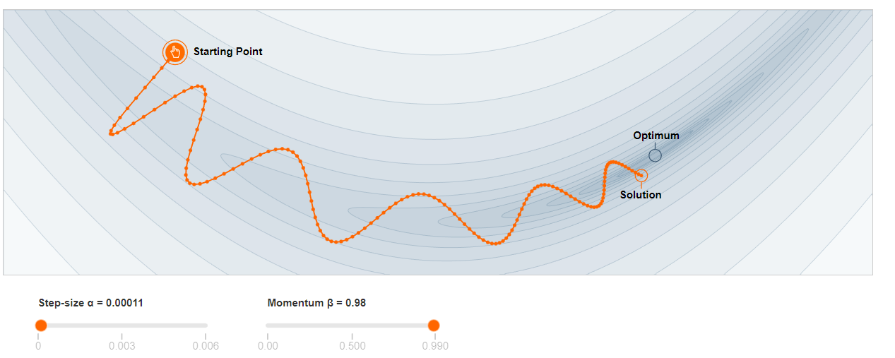

*These images are shown for ilustrative purposes. Not the actual step size of this model.*

---
## Final Model

A quite tough roof was found around 0.75 validation acc, with a decently low loss.
As this project needed to be delivered on time, the decition was to stop swinging from one side to the other, making big changes in params and architecture, in the search of a better accuracy and, on the contrary, focusing on obtaining a solid model in order not to have any surprises at the moment of evaluating it in the test set.

~~~
Validation Accuracy: 0.71
Validation Loss: 1.29
~~~

<ins>More graphically, this is what it was prioritized.<ins>


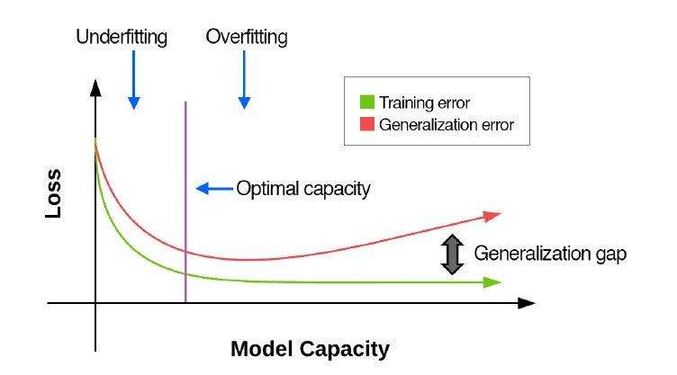
<br><br>

**It can be appreciated the "starting point" from Warm up stage, which is the orange curve.**
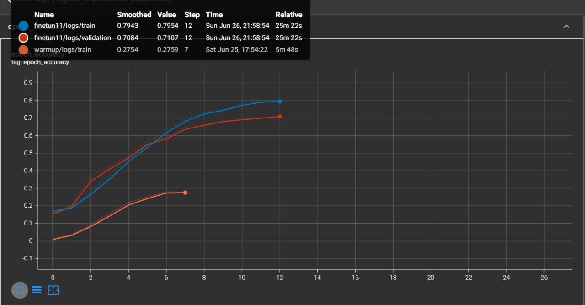

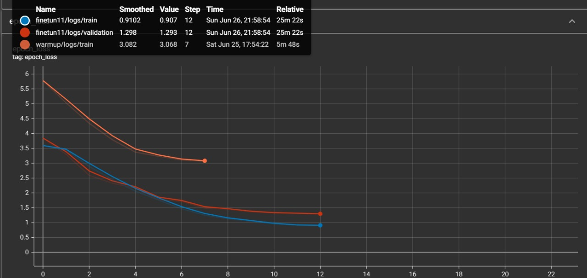

Model summary:

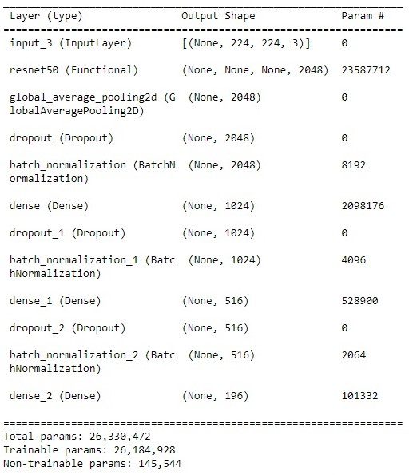

---
## Final Results

~~~
As expected, the model generalized pretty well, leading to an accuracy in Test Set of 0.68.
~~~

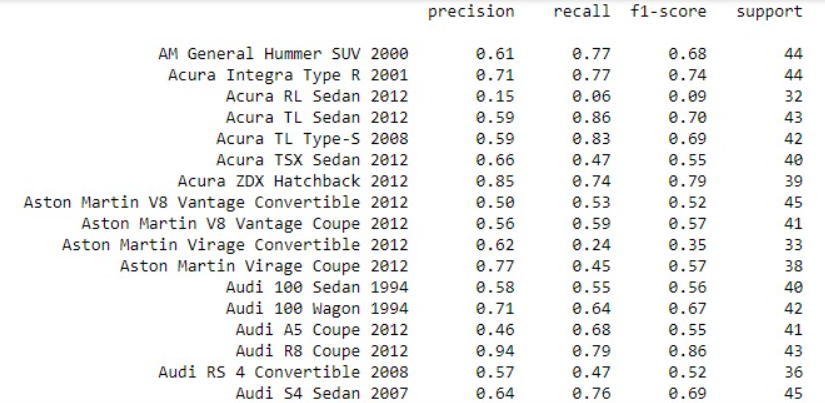
<br><br>

<ins>**In conclusion:**
- [ ] Not that high accuracy but solid model that generalizes well with low loss.
- [ ] Model trained with relative low computational effort and few epochs. 21 in total, between Warm up and Fine Tuning.
- [ ] High probability of improving it by finding the correct continuous automated Learning Rate Schedule along a larger amount of epochs.

[^1]: This was done on purpose, in order to lead to a lot of experimentation to try to bypass these difficulties, and by this, getting a better grasp of model architectures and fine tuning intuition.
